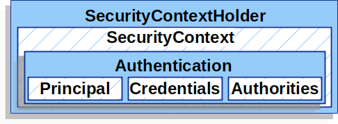

## `Authentication`

https://docs.spring.io/spring-security/reference/servlet/authentication/architecture.html

`Authentication` is the class that represents the logged-in user.
It contains:
- The **principal**, which is the user's identity (name, 
email, ...).
- The `GrantedAuthorities`: representations of the
permissions of the user.
- `isAuthenticated()`: this is almost always `true`.
- `details` about the request (e.g. IP address).
- Credentials, like the password, a certificate,
or a token. It's often `null` because it's not set by
Spring Security in the first place.

Out of these, only the **principal** and `GrantedAuthoritie`
are really of interest for the developer.

The **principal** object is accessed via `Authentication.getPrincipal()`.
If we have a look at the source code of the `Authentication` interface, we
see that it looks like this:
```java
public interface Authentication extends Principal, Serializable {
	Object getPrincipal();
}
```
There are 2 principals
- The one in `extends Principal`. This is is a Java interface.
It's the Java idea of what an authenticated entity is.
- The one that `getPrincipal()` returns. This has type `Object`
because in theory, every library developer can create their own
type of **principal**: it could for example be just a string,
or an object with `email` and `lastLoggedIn` properties.

**We MUST NOT use Principal** by injecting it into our Controllers:
```java
@RestController
public class MyController {
  @GetMapping("/")
  public String somePage(Principal principal) {}
}
```
(Please note that by doing the above, we would get an `Authentication` object,
so we would have to cast it to `Authentication` and do `principal.getPrincipal()`).

Instead, **we should use Authentication** in our components:
```java
@RestController
public class MyController {
  @GetMapping("/")
  public String somePage(Authentication authentication) {}
}
```
The `Authentication.getPrincipal()` object represents the Spring
Security idea of what an authenticated entity is, and has
more information and functionalities than the Java one.

As a general rule: in our applications, we should always
try to use the highest level of abstraction that's available.

## `SecurityContextHolder`

It's a global static object. It's only available in the thread that's currently
processing the request. It's cleaned up by Tomcat after the current request has
been processed, so the next request that uses the same thread does not still the
previous authentication. It holds the `SecurityContext`, which contains
the `Authentication`.

Getting an `Authentication` object like this:
```java
@RestController
public class MyController {
  @GetMapping("/")
  public String somePage(Authentication authentication) {}
}
```
is equivalent to doing it like this:
```java
@RestController
public class MyController {
  @GetMapping("/")
  public String somePage() {
    Authentication authentication = SecurityContextHolder.getContext().getAuthentication();
  }
}
```
The advantage of the second approach is that it can be used in services,
at any point of the code flow.

The class relationships are explained by the following picture:


------

CHATGPT SUMMARY

# Spring Security Authentication Architecture Summary

Spring Security provides a comprehensive authentication mechanism that enables developers to secure applications by enforcing authentication and authorization policies. The authentication process in Spring Security follows a standard flow and can be configured to support a variety of authentication mechanisms.

## Key Concepts

### 1. **Authentication Manager**
The core component that performs authentication by checking credentials against a set of `AuthenticationProvider` instances. It is responsible for delegating the authentication process.

### 2. **AuthenticationProvider**
This component is responsible for processing authentication requests. Spring Security provides several `AuthenticationProvider` implementations, such as:
- **DaoAuthenticationProvider**: Uses a data source (like a database) to verify the credentials.
- **LdapAuthenticationProvider**: Handles LDAP-based authentication.
- Custom providers can be created for specific authentication needs.

### 3. **Authentication**
Represents the principal and the authorities granted to a user. It contains authentication information, such as username, password, and granted roles or permissions.

### 4. **SecurityContextHolder**
A context holder that stores the `Authentication` object for the currently authenticated user. It allows access to the principal, user details, and authorities throughout the application.

### 5. **AuthenticationFilter**
A servlet filter that intercepts incoming requests and extracts authentication credentials (like username and password) from the request. Common filters include `UsernamePasswordAuthenticationFilter` and `BearerTokenAuthenticationFilter` for OAuth2 and JWT-based authentication.

## Authentication Flow

The authentication process typically follows these steps:

1. **Client Request**: A client sends an HTTP request that requires authentication.
2. **AuthenticationFilter**: The filter intercepts the request and attempts to extract credentials.
3. **AuthenticationManager**: The `AuthenticationManager` is invoked to authenticate the user, using an appropriate `AuthenticationProvider`.
4. **AuthenticationSuccessHandler / AuthenticationFailureHandler**: If authentication succeeds, the `AuthenticationSuccessHandler` is triggered. If authentication fails, the `AuthenticationFailureHandler` manages the response.

## Authentication Process Variants

### 1. **Basic Authentication**
Uses HTTP Basic Authentication headers for username and password transmission. It is supported out-of-the-box by Spring Security.

### 2. **Form-Based Authentication**
A user is authenticated via a login form. The form typically collects a username and password and then submits these credentials to the server.

### 3. **OAuth2 and OpenID Connect**
Spring Security supports OAuth2 and OpenID Connect for delegated authentication, often used in Single Sign-On (SSO) scenarios. Spring Security provides dedicated support for OAuth2 login and token-based authentication.

### 4. **Custom Authentication**
Developers can define their own authentication schemes by implementing custom filters or authentication providers.

## Authentication Configuration

Spring Security can be configured using Java configuration classes (`@Configuration` and `@EnableWebSecurity`) to define security rules, authentication mechanisms, and custom filters. A typical configuration example involves:

- Specifying the `AuthenticationManager` bean.
- Configuring authentication providers.
- Enabling various authentication mechanisms (like form login or OAuth2).

---

This summarizes the structure of authentication in Spring Security, its components, flow, and configuration options. Let me know if you need any more details on a specific part!
